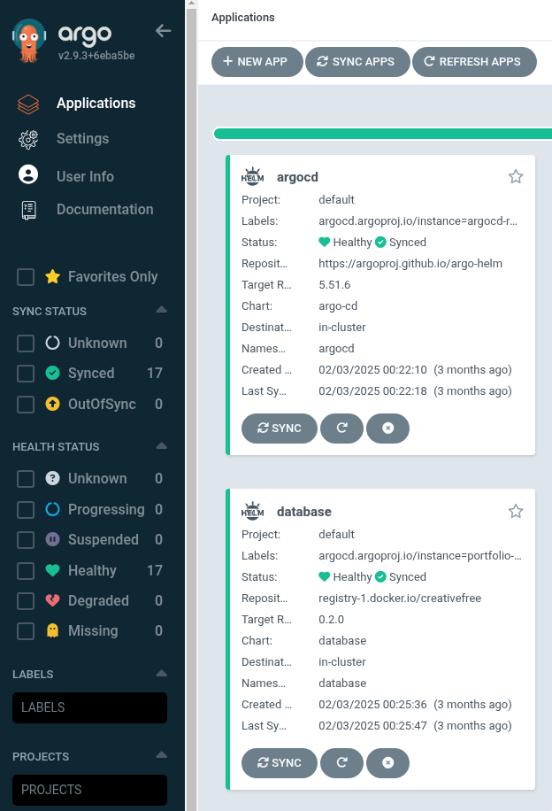

## What is GitOps

GitOps is a branch of Devops that focuses on using Git to as the source of truth for infrastructure provisioning and application deployment. In contrast Devops often treats configuration files as the source of truth which may or may not be stored in Git. Both GitOps and DevOps use IAC (Infrastructure as Code) to provision infrastructure. For GitOps the configuration must be versioned tracked with Git and follow similar workflows we use for our applications such as feature branching and pull requests. The Git repository then becomes the source of truth for the system and a sync mechanism will often be used to automatically sync the state of the system with the state defined in the repository. This brings many benefits as it prevents configuration drift where the state of our system might drift from what we want and ensures that all configuration changes can be reviewed and tracked. Since everything is tracked with git we can easily rollback any changes and ensure consistent deployments.

GitOps is often used with Kubernetes as the declarative model of GitOps works well with the declarative model of Kubernetes. We describe what we want in Git and let a framework handle the deployment and syncing. Likewise in Kubernetes we describe our desired services and let Kubernetes handles the complex orchestration. Common GitOps tools used with Kubernetes are ArgoCD and Flux. These frameworks run in our Kubernetes cluster and handle deploying our services and keeping the state in sync with our Git repository. While GitOps is not exclusive to Kubernetes the rest of this article will focus on Gitops with Kubernetes and ArgoCD.

## What is ArgoCD

ArgoCD is a framework that runs as a controller in Kubernetes and handles deploying our applications and services to Kubernetes and keeping then in sync with our defined state in Git. Applications are defined in YAML files and we can specify sources from Git repositories or container registries. These application definitions should themselves be in a Git repository. It's important to note that ArgoCD does not replace IAC tools such as Ansible, Terraform or Pulumi but works together with them. IAC handles the initial provisioning of infrastructure while ArgoCD handles the application layer everything in our cluster. ArgoCD runs in our cluster and continuously monitors Git repositories for changes and keeps our cluster in sync. A big advantage is that instead of needing to push our applications to Kubernetes via a CD pipeline with kubectl apply or helm install, we just need to update a version number in our repo and ArgoCD will pull the latest changes and apply them. This is great for security as our CD pipelines do not need access to our cluster. ArgoCD also provides a nice visual dashboard where we can easily see everything we have deployed and our deployment status.

## Deploying an application with ArgoCD

I will walk you through the deployment process I used to configure and deploy my Kubernetes cluster and blog site. This involves creating a Git repository, adding a bootstrap folder with our Infrastructure as code to provision our infrastructure and cluster and a components folder with everything we want ArgoCD to deploy into our cluster. Check out the repository here on my Github if your're interested. Lets get started.

### Bootstrapping

The first step is using infrastructure as code to bootstrap our cluster. This should be the minimum needed to get our cluster up and running as ArgoCD will handle everything inside our cluster. For my example I am deploying a simple single node cluster to a VPS with Ansible, but the same concepts would apply when deploying a more complex multi node cluster to a cloud provider with Terraform or Pulumi. Ansible scripts configure the firewall, installs Kubernetes and configures our node, configures networking, installs Helm and finally installs ArgoCD.

### Root app

A root app helm chart is used to bootstrap the cluster, this tells ArgoCD to use this repository as the source of truth and install everything in the components folder.

This is an example of my specification for ArgoCD root app. For destination server we use the Kubernetes API server,
the internal address is used as ArgoCD is running on the same cluster. For the source we specify our repo and provide the path to the components folder. The sync policy means ArgoCD will delete anything no longer defined in our Git repo and selfHeal set to true means ArgoCD will revert any manual changes made directly to the cluster and restore the state to what is defined in Git.

### Components

The components folder stores everything we want to deploy and manage via ArgoCD in our cluster. It is up to you how to organise this, I have organised this into folders defined by function. The apps folder contains the applications I want to deploy, for example my blog site. Kubernetes manifests are used to define what we want to deploy.

Yaml definition for deploying my blog site with Argocd:

I will give a quick run through of how we define an application for ArgoCD in Yaml. First we specify we want an application resource, this represents a deployed application in an environment. Next we specify the sources, note that we can specify multiple sources. Here I have a git repository for my application code with the path to a helm chart and a helm chart I use for deploying an NGINX ingress from my Dockerhub container registry. Its important to note that ArgoCD does not use helm install command to install helm charts, but will run helm template and deploy the resulting manifest with kubectl apply. We can also put any kind of Kubernetes manifest in our repo and ArgoCD will deploy this.

Next I have an ArgoCD folder which defines all the configuration I need for ArgoCD itself. ArgoCD is installed via a helm chart along with additional networking polices and ingress.

I have a certs folder which contains a manifest for deploying cert manager which handles generating SSL certs from Lets Encrypt for our applications.

A database folder for my postgres database, it's not especially common to run databases in Kubernetes but is great for my projects and apps. I also have a deployment which automatically backs up the database to an S3 bucket everyday.

An ingress folder for deploying NGINX along with configurations for my different apps.

A metrics folder for deploying Promethesus, Jaeger and Loki for monitoring with Open Telemetry.

A storage folder containing a manifest to deploy OpenEBS which provides container native storage in Kubernetes.

Note: The kustomization.yaml files in each folder define which folders and files we want ArgoCD to be aware of.

The beauty of this is that ArgoCD will automatically deploy everything in these folders! It even provides a nice dashboard so we can easily see everything we've deployed! If someone manually changes any configuration in my cluster ArgoCD will automatically revert it to what I have defined in my repo. When I want to deploy the latest changes to my blog site a CD pipeline for my blog site simply updates the image tag in my helm chart, ArgoCD will automatically pick this up and deploy the latest changes. No need for my CD pipeline to push to my cluster or have any knowledge of my cluster at all!

My ArgoCD dashboard:

### Secrets

ArgoCD is unopinionated about how you manage secrets and many options are available. I decided to use SOPs encrytion. A plugin for ArgoCD, KSOPs, means that I can store my encrypted secrets in my git repo and ArgoCD will automatically handle decrypting them when deploying. The secret key used for decryption is stored in a Kubernetes secret.

### Conclusion

ArgoCD is a fantastic tool for managing and deploying applications in Kubernetes. It has made managing my cluster much easier by using git as the source of truth and automatically syncing changes. By having everything defined in git my cluster is easily 100% reproducible and I don't need to worry about forgetting any secrets or configuration details if I ever need to re-deploy my cluster. It is obviously overkill for my blog site but was a fantastic learning experience and I can see using many of the principles of Gitops in my everyday work. Even more importantly, these patterns become invaluable when managing multiple environments or scaling to production workloads where consistency and reliability are critical.
